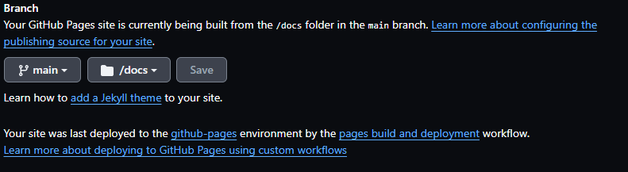

## ISE_Template_doc

This repository acts as the primary location for storing information about employing a template on READTHEDOCS without the need for configuration. It's essential to note that this is a simple template intended to facilitate the documentation process.

## Commands 

To start, you'll need to install Sphinx:
```bash
pip install -U sphinx
```

Next, install the theme:
```bash
pip install sphinx sphinx_rtd_theme
```
generate a PDF file, install MIKTEX for windows 

- [MikTeX](https://miktex.org/download)


## Creating the Project

Create a directory and navigate into it. I suggest utilizing Git Bash on Windows and the terminal on Linux:
> [!TIP]
> It is suggested to open the terminal in Windows using Git Bash, and in Linux, use the terminal.

```bash
mkdir src && cd src && sphinx-quickstart
```

After creating the project, find the `conf.py` file, open it, and add the theme:
```python
extensions = ['sphinx.ext.autodoc', 'sphinx.ext.viewcode', 'sphinx.ext.napoleon', 'rst2pdf.pdfbuilder']
.
.
html_theme = 'sphinx_rtd_theme'


```

### Create a Makefile

Create a file named Makefile, and copy & paste the following:

```Makefile
# File Names
NAME = ROUST
file = src
# Symbolic Targets
help:
	@echo "Use the following commands:"
	@echo "make all     create files and build the project"
	@echo "make pdfr     create the project environment"
	@echo "make clean   remove all  files"


all: build

build:
	@rm -rf docs && mkdir docs
	@cd src && ./make.bat clean && ./make.bat html
	@cp -R src/build/html/* docs && touch docs/.nojekyll
	@echo "Documentation built and copied to docs"

pdfw:
	@rm -rf pdf && mkdir pdf
	@cd src && ./make.bat clean && sphinx-build -M latexpdf source ../pdf	
	@echo "PDF built and copied to docs"
	@make build

pdfx:
	@rm -rf pdf && mkdir pdf
	@cd src && ./make.bat clean &&  sphinx-build -b pdf source build
	@cp src/build/*.pdf pdf && cd src && ./make.bat clean	
	@echo "PDF built and copied to docs"
	@make build

clean:
	@rm -rf docs
	@rm -rf pdf
	@rm -rf src
	@echo "All files removed"


```

## Compiling the Project

Once you've edited the files in the `source` directory, you can build the project using the following command:

For Windows:
```bash
./make.bat html
```

For Linux:
```bash
make html
```

## Deploying the Page 

Create a directory named `docs`:
```bash
mkdir docs
```

Copy the `html` directory to `docs`:
```bash
cp -R src/build/html/* docs/
```

Within the `docs` directory, create a file:
```bash
touch .nojekyll
```

## Configuring GitHub Pages with the Main Branch and `/docs` folder




## Page tested

[ISE_Template_doc](https://cesarbautista10.github.io/ISE_Template_doc/)


